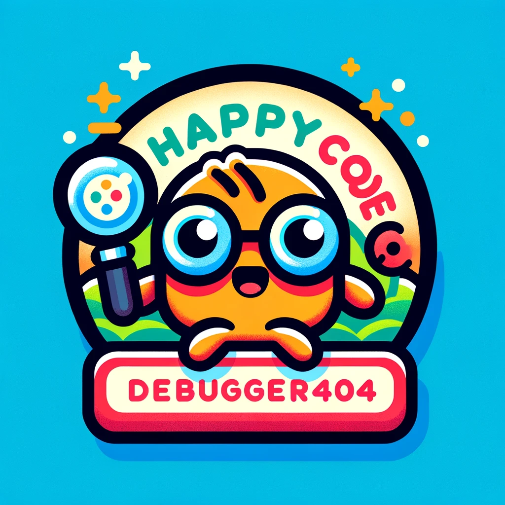

# Python Course: From Beginner to Expert

Welcome to the **Python Course** series! This repository accompanies the YouTube tutorial series designed to take you from a Python novice to an expert. You’ll find code examples, exercises, and additional resources for each video. Whether you're just starting or looking to deepen your Python knowledge, this course has something for you. 

## Table of Contents

### Beginner Level
1. [Introduction to Python](#introduction-to-python)
2. [Basic Python Syntax](#basic-python-syntax)
3. [Control Flow](#control-flow)
4. [Functions](#functions)
5. [Data Structures](#data-structures)
6. [Working with Strings](#working-with-strings)

### Intermediate Level
7. [File Handling](#file-handling)
8. [Modules and Packages](#modules-and-packages)
9. [Object-Oriented Programming (OOP)](#object-oriented-programming-oop)
10. [Error Handling and Exceptions](#error-handling-and-exceptions)
11. [Working with Date and Time](#working-with-date-and-time)
12. [Comprehensions](#comprehensions)

### Advanced Level
13. [Advanced OOP Concepts](#advanced-oop-concepts)
14. [Iterators and Generators](#iterators-and-generators)
15. [Decorators](#decorators)
16. [Context Managers](#context-managers)
17. [Testing in Python](#testing-in-python)
18. [Regular Expressions](#regular-expressions)
19. [File I/O and Serialization](#file-io-and-serialization)
20. [Concurrent and Parallel Programming](#concurrent-and-parallel-programming)
21. [Working with APIs](#working-with-apis)
22. [Data Science with Python](#data-science-with-python)
23. [Web Development with Python](#web-development-with-python)
24. [Deployment and Automation](#deployment-and-automation)
25. [Best Practices](#best-practices)

## Course Overview

This series is designed to provide a comprehensive education in Python, from the basics to more advanced concepts. Each section below corresponds to a video in the YouTube series. The repository is organized into folders that match the sequence of topics in the course.

---

## Beginner Level

### Introduction to Python

- What is Python?
- Installing Python and setting up the environment
- Running Python scripts

[Watch the Video on YouTube](https://www.youtube.com/watch?v=your-video-link-here)

**[Code Examples](./Beginner%20Level/1.%20Introduction%20to%20Python.ipynb/)**

### Basic Python Syntax

- Variables and Data Types
- Basic Operators
- Input and Output

[Watch the Video on YouTube](https://www.youtube.com/watch?v=your-video-link-here)

**[Code Examples](./Beginner%20Level/2.%20Python_Syntax.ipynb/)**

### Control Flow

- Conditional Statements (if, elif, else)
- Loops (for, while)
- Break, Continue, and Pass statements

[Watch the Video on YouTube](https://www.youtube.com/watch?v=your-video-link-here)

**[Code Examples](./Beginner%20Level/3.%20Control%20Flow.ipynb/)**

### Functions

- Defining Functions
- Parameters and Return Values
- Scope and Lifetime of Variables
- Lambda Functions

[Watch the Video on YouTube](https://www.youtube.com/watch?v=your-video-link-here)

**[Code Examples](./Beginner%20Level/4.%20Functions.ipynb/)**

### Data Structures

- Lists
- Tuples
- Sets
- Dictionaries

[Watch the Video on YouTube](https://www.youtube.com/watch?v=your-video-link-here)

**[Code Examples](./Beginner%20Level/5.%20Data%20Structures.ipynb/)**

### Working with Strings

- String Manipulation
- String Methods
- Formatting Strings
- Regular Expressions (basic introduction)

[Watch the Video on YouTube](https://www.youtube.com/watch?v=your-video-link-here)

**[Code Examples](./Beginner%20Level/6.%20Python%20Strings.ipynb/)**

---

## Intermediate Level

### File Handling

- Reading and Writing Files
- Working with CSV files
- Exception Handling (try, except, finally)

[Watch the Video on YouTube](https://www.youtube.com/watch?v=your-video-link-here)

**[Code Examples](./Intermediate%20Level/file-handling/)**

### Modules and Packages

- Importing Modules
- Creating your own Modules
- Python Standard Library Overview (os, sys, math, random, etc.)

[Watch the Video on YouTube](https://www.youtube.com/watch?v=your-video-link-here)

**[Code Examples](./Intermediate%20Level/modules-and-packages/)**

### Object-Oriented Programming (OOP)

- Classes and Objects
- Inheritance
- Polymorphism
- Encapsulation and Abstraction

[Watch the Video on YouTube](https://www.youtube.com/watch?v=your-video-link-here)

**[Code Examples](./Intermediate%20Level/oop/)**

### Error Handling and Exceptions

- Understanding Exceptions
- Raising Exceptions
- Custom Exceptions

[Watch the Video on YouTube](https://www.youtube.com/watch?v=your-video-link-here)

**[Code Examples](./Intermediate%20Level/error-handling/)**

### Working with Date and Time

- The datetime module
- Formatting and Parsing Dates
- Time Arithmetic

[Watch the Video on YouTube](https://www.youtube.com/watch?v=your-video-link-here)

**[Code Examples](./Intermediate%20Level/date-and-time/)**

### Comprehensions

- List Comprehensions
- Dictionary Comprehensions
- Set Comprehensions

[Watch the Video on YouTube](https://www.youtube.com/watch?v=your-video-link-here)

**[Code Examples](./Intermediate%20Level/comprehensions/)**

---

## Advanced Level

### Advanced OOP Concepts

- Class Methods and Static Methods
- Properties and Descriptors
- Method Resolution Order (MRO)
- Metaclasses

[Watch the Video on YouTube](https://www.youtube.com/watch?v=your-video-link-here)

**[Code Examples](./Advanced%20Level/advanced-oop/)**

### Iterators and Generators

- Understanding Iterators
- Building Generators with yield
- Generator Expressions

[Watch the Video on YouTube](https://www.youtube.com/watch?v=your-video-link-here)

**[Code Examples](./Advanced%20Level/iterators-and-generators/)**

### Decorators

- Function Decorators
- Class Decorators
- Using Decorators with Parameters

[Watch the Video on YouTube](https://www.youtube.com/watch?v=your-video-link-here)

**[Code Examples](./Advanced%20Level/decorators/)**

### Context Managers

- The with statement
- Writing Custom Context Managers
- Using contextlib

[Watch the Video on YouTube](https://www.youtube.com/watch?v=your-video-link-here)

**[Code Examples](./Advanced%20Level/context-managers/)**

### Testing in Python

- Unit Testing with unittest
- Test-driven Development (TDD)
- Mocking and Patching

[Watch the Video on YouTube](https://www.youtube.com/watch?v=your-video-link-here)

**[Code Examples](./Advanced%20Level/testing/)**

### Regular Expressions

- Advanced String Manipulation
- Pattern Matching
- Practical Examples

[Watch the Video on YouTube](https://www.youtube.com/watch?v=your-video-link-here)

**[Code Examples](./Advanced%20Level/regular-expressions/)**

### File I/O and Serialization

- Working with JSON, XML, and CSV
- Pickle Serialization

[Watch the Video on YouTube](https://www.youtube.com/watch?v=your-video-link-here)

**[Code Examples](./Advanced%20Level/file-io-and-serialization/)**

### Concurrent and Parallel Programming

- Threads vs. Processes
- The threading module
- The multiprocessing module
- Asynchronous Programming with asyncio

[Watch the Video on YouTube](https://www.youtube.com/watch?v=your-video-link-here)

**[Code Examples](./Advanced%20Level/concurrent-programming/)**

### Working with APIs

- Consuming Web APIs
- RESTful APIs using requests
- Handling Authentication

[Watch the Video on YouTube](https://www.youtube.com/watch?v=your-video-link-here)

**[Code Examples](./Advanced%20Level/working-with-apis/)**

### Data Science with Python

- Introduction to pandas
- Data Visualization with matplotlib and seaborn
- Basic Statistics and Probability
- Introduction to Machine Learning with scikit-learn

[Watch the Video on YouTube](https://www.youtube.com/watch?v=your-video-link-here)

**[Code Examples](./Advanced%20Level/data-science/)**

### Web Development with Python

- Flask Basics
- Building a REST API with Flask
- Django Overview
- Working with Databases (SQLAlchemy, Django ORM)

[Watch the Video on YouTube](https://www.youtube.com/watch?v=your-video-link-here)

**[Code Examples](./Advanced%20Level/web-development/)**

### Deployment and Automation

- Deploying Python Applications
- Automation with fabric, invoke, or ansible
- Packaging Python Projects (pip, virtualenv, setuptools)

[Watch the Video on YouTube](https://www.youtube.com/watch?v=your-video-link-here)

**[Code Examples](./Advanced%20Level/deployment-and-automation/)**

### Best Practices

- Code Style (PEP 8)
- Writing Clean and Maintainable Code
- Version Control with Git
- Documentation with Sphinx

[Watch the Video on YouTube](https://www.youtube.com/watch?v=your-video-link-here)

**[Code Examples](./Advanced%20Level/best-practices/)**

---

## License

This project is licensed under the MIT License - see the [LICENSE](./LICENSE) file for details.

---

  

